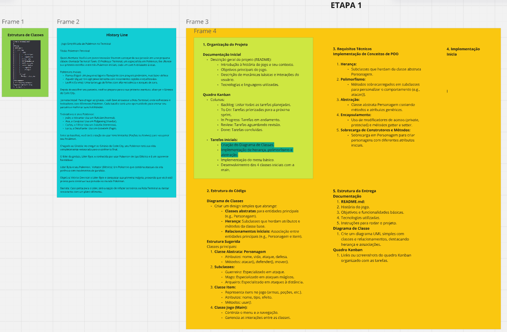

# Squad 12 - Projeto Final Java

## Integrantes
| Nome               | GitHub                                                     |
|---------------------|------------------------------------------------------------|
| Diogo Graciano      | [@graciiano](https://github.com/graciiano)                 |
| Felipe Bisotto      | [@felipe](https://github.com/FelipeBisotto)                |
| Jhonatan Gonçalves  | [@jhonatan](https://github.com/jhonatan-goncalves-pereira) |
| Pedro Possari       | [@pedro](https://github.com/PedroPossari)                  |
***
## Tópicos

| Tópicos             | Direcionamento              |
|---------------------|-----------------------------|
| Historia            | [clique aqui](#história)    |
| Etapa 1             | [clique aqui](#etapa-1)     |
| Etapa 2             | [clique aqui](#etapa-2)     |
| Branches Utilizadas | [clique aqui](#branches)    |
| Referências         | [clique aqui](#referências) |
***
## Galeria
| Galeria  | Direcionamento                         |
|----------|----------------------------------------|
| Kanban   | [clique aqui](#quadro-kanban)          |
| Diagrama | [clique aqui](#diagrama-de-classes)    |
| Miro     | [clique aqui](#miro)                   |
| Etapa II | -------------------------------------  |
| Kanban   | [clique aqui](#quadro-kaban-02)        |
| Diagrama | [clique aqui](#diagrama-de-classes-02) |
*** 
## Branches Utilizadas
| Branches | Direcionamento           |
|----------|--------------------------|
| Branches | [clique aqui](#branches) |

***
# História
## Devmon Saga

## **Introdução**
Você é um(a) jovem **TREINADOR(a)** prestes a iniciar a sua jornada em **DevmonCity**, uma metrópole conhecida pela enorme diversidade de **DevMons** – criaturas exóticas que possuem habilidades únicas.

A cidade, apesar de sua modernidade, é marcada pela sombra de um grande mal: **Comandante Byte**. Byte é um antigo caçador de DevMons que, com o tempo, começou a capturá-los e realizar experiências cruéis sobre essas criaturas, buscando explorar suas habilidades para seu próprio benefício. Hoje, ele controla **DevmonCity** através de um impiedoso torneio de batalhas entre DevMons, onde os participantes competem pelo poder e pela glória, mas à custa do sofrimento dos DevMons.

**Professor Hash**, um renomado especialista no estudo de DevMons, é seu amigo e mentor. Seu desafio é derrotar o **Comandante Byte**, pôr fim às batalhas forçadas e libertar os DevMons de sua tirania. Para isso, você terá de escolher um dos três **DevMons iniciais**, que será o seu companheiro leal ao longo dessa perigosa jornada.

Agora, à espera de sua escolha, o Professor Hash se aproxima e diz:  
*"Você está prestes a dar o primeiro passo em uma missão que mudará tudo. Escolha sabiamente, pois este DevMon será seu parceiro até o final do torneio... e da sua luta contra o Comandante Byte."*

---

## **Devmons Iniciais**

### **JavaScripto** (Fogo)

Um pequeno lagarto de escamas flamejantes, com olhos ardentes e cauda em chamas. JavaScripto é impetuoso e sempre pronto para atacar com movimentos poderosos como **Chama Escaldante**. No entanto, sua defesa é baixa, o que o torna vulnerável a ataques rápidos. Ideal para quem gosta de um estilo de combate direto e agressivo.

### **CShapa** (Água)

CShapa é uma cobra aquática ágil, com escamas brilhantes e nadadeiras fortes. Seu corpo flexível permite que ele seja rápido e adaptável durante as batalhas. Ele usa movimentos como **Jato d'Água** e **Golpe Aquático**, que são rápidos e equilibrados, tornando-o um DevMon versátil. Perfeito para quem gosta de ataques rápidos e precisos.

### **Javinha** (Grama)

Javinha é uma tartaruga de folhas robusta, com uma carapaça de plantas resistentes. Ele possui habilidades naturais de cura, como **Cura Natural**, e ataques como **Folha Navalha**. Javinha tem uma resistência notável e pode aguentar ataques fortes, tornando-o ideal para quem prefere uma abordagem defensiva e tática.

---

## **Jornada Inicial**
Ao longo do caminho, você enfrentará 4 treinadores dentro do Ginásio, cada um com seu próprio estilo de batalha e DevMon único. Cada batalha será uma chance de fortalecer o vínculo com seu DevMon, melhorar suas habilidades e progredir para a próxima fase até a batalha final.

### **Treinadores e seus DevMons**

1. **Junior Debugadinho**  
   
    - **DevMon:** PHPenho (Tipo Normal) - Rato
      PHPenho é um rato ágil e astuto, com olhos brilhantes e uma pelagem marrom clara que o ajuda a se camuflar no ambiente. Suas garras afiadas são perfeitas para ataques rápidos, e ele possui dentes resistentes para mordidas precisas. PHPenho é pequeno, mas sua velocidade e inteligência compensam sua falta de força bruta. Seus movimentos Investida e Desarme refletem sua agilidade e capacidade de explorar as fraquezas do adversário.
    - **Ataques:** Investida, Desarme
    - Junior é um jovem com pouca experiência, mas confiante. Essa batalha será uma boa introdução ao básico das lutas DevMon.

2. **Ana Compilada**
   
    - **DevMon:** Pythinho (Tipo Voador) - Falcão
      Pythinho é um falcão de plumagem azul e cinza, com olhos penetrantes que parecem prever os movimentos do adversário. Suas asas poderosas o tornam extremamente rápido e ágil no ar, permitindo que ele crie pequenos redemoinhos com seu ataque Turbilhão. Suas garras afiadas podem cortar até os oponentes mais bem protegidos com o movimento Asa Cortante. Pythinho representa estratégia e precisão, refletindo a personalidade destemida de Ana
    - **Ataques:** Turbilhão, Asa Cortante
    - Ana é uma treinadora destemida, que não subestima ninguém e oferece estratégias desafiadoras.

3. **Rafael deGit**
   
    - **DevMon:** Rustin (Tipo Venenoso) - Dragão de Komodo
      Rustin é uma criatura intimidadora, com escamas escuras que brilham com tons esverdeados, refletindo seu veneno mortal. Suas garras são longas e afiadas, e sua língua bifurcada parece captar cada movimento do adversário. O ataque Mordida Tóxica injeta veneno paralisante, enquanto Sombra Silenciosa permite que ele se mova furtivamente, escapando de golpes e preparando emboscadas. Rustin é perigoso e calculista, refletindo a natureza estratégica de Rafael.
    - **Ataques:** Mordida Tóxica, Sombra Silenciosa
    - Rafael é um estrategista sorrateiro, especialista em criar caos e virar batalhas a seu favor.

4. **Cris Reactonix**
   
    - **DevMon:** Gitflame (Tipo Fogo) - Fenix
      Gitflame é uma fênix majestosa, com penas que brilham como brasas vivas. Seu corpo é envolto em chamas que dançam ao ritmo de suas asas. Seus olhos emanam um calor intenso, enquanto suas garras e bico podem causar danos devastadores. O ataque Cruzada Flamejante cria uma onda de fogo que incinera tudo em seu caminho, enquanto Explosão de Fogo envolve seu corpo em uma explosão incandescente, causando dano em área.
    - **Ataques:** Cruzada Flamejante, Explosão de Fogo
    - Cris é uma treinadora obstinada, com ataques massivos e devastadores que exigem estratégia para contra-atacar.

---

## **Luta Final no Ginásio de DevmonCity**
Depois de derrotar todos os treinadores e ver seu DevMon evoluir para sua forma mais poderosa, você chega ao Ginásio de **DevmonCity**, onde o **Comandante Byte** o espera. A cidade inteira está enlouquecendo, com cidadãos se aglomerando ao redor do ginásio para testemunhar a batalha mais esperada da história.

### **Comandante Byte e seu DevMon**

- **Cobolin** (Tipo Elétrico)  
  É um **DevMon híbrido**, resultado das experiências cruéis realizadas pelo Comandante Byte. Combinando traços de vários DevMons capturados, ele é uma criatura artificial de eletricidade pura, projetada para ser quase imbatível. Seu corpo emite descargas elétricas constantes, e seus olhos brilham como relâmpagos, refletindo sua origem antinatural.

#### **Ataques de Syntaxaur**
- **Raio Fatal:** Um golpe de energia concentrada capaz de causar danos massivos.  
- **Paralisia Elétrica:** Uma habilidade que pode imobilizar seu DevMon, dificultando qualquer reação e deixando-o vulnerável.

---

## **Objetivo do Jogo**
### **Vitória**
Ao derrotar o Comandante Byte, você ganhará o título de **Líder de DevmonCity**. Contudo, ao reconhecer o verdadeiro propósito de sua jornada, você decidirá passar esse título ao **Professor Hash**, que cuidará dos DevMons e dará fim às batalhas forçadas. Sob sua liderança, **DevmonCity** será transformada em um santuário para proteger e estudar essas criaturas incríveis.

### **Derrota**
Caso perca, o Comandante Byte capturará seu **DevMon**, usando-o como cobaia para seus experimentos cruéis. Ele continuará controlando **DevmonCity**, forçando mais batalhas impiedosas e espalhando sua tirania. A esperança de libertar os DevMons será esmagada... a menos que você retorne, mais forte e determinado, para tentar novamente e salvar seu fiel companheiro.

---

## **Diálogo na Batalha Final**
**Comandante Byte:**  
*"Então, você finalmente chegou. Um treinador patético ousando desafiar o meu ginásio, a minha cidade, o meu poder... Interessante. Tenho observado seus passos desde que pôs os pés em DevmonCity. Cada vitória sua não foi nada além de um teste para provar se você era digno de chegar até mim. Mas me diga: o que faz você pensar que pode derrotar alguém que controla tudo aqui? Eu criei este mundo. Eu controlo estes DevMons. Você não passa de mais uma peça no meu tabuleiro."*

**Jogador:**  
*"Você pode ter criado este pesadelo, Byte, mas ele termina hoje! Minha jornada não é só sobre vencer batalhas, é sobre libertar os DevMons da sua tirania. Você os tratou como ferramentas, experimentou com eles e os usou para alimentar seu ego. Mas eu vou provar que o vínculo entre treinador e DevMon é mais forte do que qualquer força artificial que você possa controlar!"*

**Comandante Byte:**  
*"Libertar os DevMons? Que pensamento ingênuo! Eles foram criados para servir, para lutar, para evoluir sob o meu comando. Não há lugar para sentimentos ou vínculos neste mundo. O que você chama de 'parceiro', eu vejo como um recurso descartável. E hoje, eu vou provar isso. Prepare-se, forasteiro. Seu DevMon não passará de mais um experimento no meu laboratório."*

**Jogador:**  
*"Eu não vou deixar isso acontecer. Você já causou sofrimento demais! Esta batalha não é só por mim ou pelo meu DevMon... É pelo futuro de DevmonCity!"*

**Comandante Byte:**  
*"Veremos se sua determinação é suficiente para sobreviver ao meu Syntaxaur. Que comece o seu último desafio, justiceiro!"*

***

# Etapa 1:
- Foi utilizado a metodologia ágil Kanban para desenvolver um quadro de tarefas.
- Utilizamos o diagrama de classe UML para design do projeto.
- Foi criado um padrão de nomenclatura para as branchs visando a organização.
- Desenvolvido uma parte inicial do algoritmo para pré-visualização do jogo.
- Foi criado um repositório no GitHub para o projeto.

## O que utilizamos para desenvolver o projeto?
### Quadro kanban

- **Para organização das tarefas.**

        https://github.com/users/graciiano/projects/4
  

***
### Diagrama de classes
- **Design do projeto (Diagrama de classes).**

        https://drive.google.com/file/d/1d5tZ5lULGpl7cBy8TwozmazAyUnuXuii/view?usp=sharing
    

### Miro
- **Para organização das ideias.**

        https://miro.com/app/board/o9J_lQ1JZ6A=/
  

***

# Etapa 2:
- Nesta etapa, visando a melhora do algoritmo implementamos o Java Collections.
- Foi implementado também o uso do utilitário .sort.
- Atualizações no quadro kanban para definir as tarefas.
- Atualizações no diagrama de classes (UML).
- Refinamento nos dados com que o usuário interage.

### Quadro kanban 01

- **Atualizado.**

        https://github.com/users/graciiano/projects/4
  

***
### Diagrama de classes 02
- **Atualizado.**

        https://drive.google.com/file/d/1d5tZ5lULGpl7cBy8TwozmazAyUnuXuii/view?usp=sharing
    

***

# Branches
| Main  | main                                              |
|-------|---------------------------------------------------|
| Feat: | feat-musica-console -- feat-sistema-ginasio-final |
| Feat: | feat-sistema-ginasio-final                        |
| Feat: | feat-cores-terminal                               |
| Feat: | feat-lista-devmons                                |
| Feat: | perf-array-treinadores                            |
| Feat: | feat-incrementacao-personagens                    |
| Feat: | feat-implementacao-canario-luta                   |
| Feat: | feat-sistematizando-batalha                       |
| Feat: | feat-implentando-class-jogo                       |
| Feat: | feat-sistema-ginasio                              |
| Fix   | fix-correcoes                                     |
| perf  | perf-array-treinadores                            |
| Docs  | docs-historia-do-jogo                             |

## Referências
Geração de imagens ficticias para a historia.
- [ChatGPT ](https://chatgpt.com)

Implementação de um boneco animado e musica no console.
- [StackOverflow](https://stackoverflow.com)
